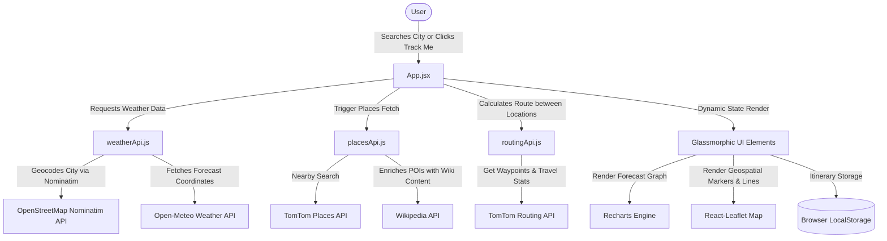

# 🌍 Dynamic Weather & Travel Dashboard

A premium, glassmorphic React dashboard that dynamically merges real-time weather forecasting, live interactive mapping, place discovery, route simulation, and trip planning. The entire interface transforms its visual appearance (background gradients, glowing highlights, and animations) in real-time, matching the weather conditions of the target city.

---

## 📌 Application Architecture Overview

This project is built using a modern, component-driven frontend architecture. It is designed to be highly responsive, offline-resilient (using browser storage), and modular.

### Architecture Data Flow Diagram


---

## 🛠️ Tech Stack: Why and How

Below is a detailed breakdown of the libraries used in this project, the rationale behind their selection, and the commands used to install them.

| Technology / Library | Why We Used It | Installation Command |
| :--- | :--- | :--- |
| **React 19 & Vite** | Offers a component-based model for stateful reactive interfaces. Vite provides instant hot-module reloading (HMR) and lightning-fast builds. | `npm install react react-dom` & `npm install -D vite @vitejs/plugin-react` |
| **Leaflet & React-Leaflet** | Open-source, lightweight alternative to Google Maps API. It requires no billing setup or API keys, is highly customizable, and wraps map components in a clean, declarative React style. | `npm install leaflet react-leaflet` |
| **Recharts** | A declarative, React-native charting library built on SVG. It provides responsive graphs, beautiful animations, and permits deep CSS customization for custom tooltip styling. | `npm install recharts` |
| **Axios** | A Promise-based HTTP client that simplifies API requests, automatically converts JSON responses, and allows custom interceptors/headers. | `npm install axios` |
| **Lucide React** | A clean, modern SVG icon library that matches our minimalist visual style. Fully tree-shakeable to keep bundle sizes low. | `npm install lucide-react` |
| **Vanilla CSS (Modern)** | Leverages modern features like CSS custom properties (`--color-accent`), flex/grid structures, and hardware-accelerated transitions for complex glassmorphic styling. | Included in the framework template (no install required) |

---

## 📖 Feature-by-Feature Technical Deep Dive

### 1. Weather-Adaptive UI
* **Concept:** The entire visual experience changes dynamically according to the climate condition of the target location.
* **Why We Used It:** Elevates user engagement by creating an immersive ambient mood that matches the weather at the destination.
* **Implementation Details:**
  * In [App.jsx](file:///c:/Users/91733/Desktop/Projects/GoogelMaps/src/App.jsx#L67-L89), a `useEffect` hook monitors changes to the `weatherData` state.
  * It extracts the current WMO weather code (e.g., `code = 61` for Rain) and maps it to a descriptive text via `getWeatherDescription(code)`.
  * The hook then updates `document.body.style.background` with smooth CSS linear gradients. 
  * The transition is animated smoothly using `transition: background-color 0.5s ease;` in [index.css](file:///c:/Users/91733/Desktop/Projects/GoogelMaps/src/index.css#L43).
  * Gradients mapping:
    * **Rain / Drizzle / Thunderstorm:** Deep slate/blue gradient (`linear-gradient(135deg, #1e293b, #0f172a)`)
    * **Cloudy / Fog:** Muted grey gradient (`linear-gradient(135deg, #475569, #1e293b)`)
    * **Clear:** Vibrant sky blue gradient (`linear-gradient(135deg, #0284c7, #0ea5e9)`)
    * **Snow:** Bright frosty grey gradient (`linear-gradient(135deg, #cbd5e1, #94a3b8)`)

---

### 2. Live Interactive Mapping
* **Concept:** Interactive geospatial tracking of current weather stations and famous tourist destinations.
* **Why We Used It:** Visualizing location-based features increases geospatial clarity. A map is fundamental to any travel planner application.
* **Implementation Details:**
  * Built using `react-leaflet` in [LiveMap.jsx](file:///c:/Users/91733/Desktop/Projects/GoogelMaps/src/components/LiveMap.jsx).
  * Overrides Leaflet's default marker icons to avoid React bundling issues by importing and merging icon assets (`marker-icon.png`, `marker-shadow.png`).
  * Utilizes `MapUpdater` helper component to dynamically pans the map view (`map.panTo()`) or adjust visible bounds (`map.fitBounds()`) whenever the user searches a new city or selects a route.
  * Map layers are served from OpenStreetMap Voyager tiles hosted on CartoDB (`https://{s}.basemaps.cartocdn.com/rastertiles/voyager/{z}/{x}/{y}{r}.png`) for a beautiful dark-mode compatible tile look.

---

### 3. Route Calculation & Navigation Simulation
* **Concept:** Fetch paths between starting coordinates and attractions, display them as polylines, and simulate real-time travel with an animated vehicle indicator.
* **Why We Used It:** Helps users estimate travel times and routes visually without having to navigate away to external mapping tools.
* **Implementation Details:**
  * Uses [routingApi.js](file:///c:/Users/91733/Desktop/Projects/GoogelMaps/src/services/routingApi.js) to connect to the **TomTom Routing API**.
  * The API response returns a polyline sequence of coordinates, travel length (meters), and duration (seconds).
  * [LiveMap.jsx](file:///c:/Users/91733/Desktop/Projects/GoogelMaps/src/components/LiveMap.jsx#L158-L165) renders this path using Leaflet’s `<Polyline>` component.
  * **Simulation Logic:** When the user clicks "Start Navigation", an animation loop begins using `setInterval` (firing every 250ms).
  * A virtual vehicle (rendered as a rotating car emoji 🚗 inside a Leaflet custom `divIcon`) moves node-by-node along the route polyline.
  * **Angle Calculation:** To ensure the car faces the correct direction of travel, the rotation angle between consecutive coordinates is calculated using trigonometry (`Math.atan2(dx, dy) * (180 / Math.PI)`).
  * Progress updates are bubbled up to [App.jsx](file:///c:/Users/91733/Desktop/Projects/GoogelMaps/src/App.jsx#L315-L367) to recalculate the remaining distance and estimated duration on-the-fly.

---

### 4. Smart Place Discovery
* **Concept:** Fetching tourist spots, parks, temples, and museums nearby and enriching them with images and summaries.
* **Why We Used It:** Simple geographic coordinates are boring. Adding real context (images, historical descriptions) creates a "smart guide" experience.
* **Implementation Details:**
  * Driven by [placesApi.js](file:///c:/Users/91733/Desktop/Projects/GoogelMaps/src/services/placesApi.js).
  * First, requests nearby Points of Interest (POIs) using the **TomTom Nearby Search API** (filtered to categories: Attractions `7376`, Museums `7374`, Parks `9362`, Places of Worship `7332`) within a 10km radius.
  * **Wikipedia Enrichment:** To bypass generic details, the app collects titles of nearby places (up to 30) and performs a batch lookup query on the public **Wikipedia API** (`prop=pageimages|extracts`).
  * If a match is found, the default stock Unsplash image fallback is replaced by Wikipedia's thumbnail source, and the address string is overridden by Wikipedia's article intro extract.

---

### 5. Live GPS Tracking
* **Concept:** Detects user current location and centers the application, searching local weather and places.
* **Why We Used It:** Minimizes user friction by automatically localizing the experience upon launching.
* **Implementation Details:**
  * Uses the HTML5 native **Geolocation API** (`navigator.geolocation.watchPosition`).
  * If tracking is enabled in [App.jsx](file:///c:/Users/91733/Desktop/Projects/GoogelMaps/src/App.jsx#L36-L64), the browser starts tracking coordinates with high accuracy.
  * Upon receiving updates, it reverse-geocodes the latitude and longitude using **TomTom's Reverse Geocoding API** to identify the municipality name, subsequently fetching local weather patterns and nearby tourist spots.

---

### 6. Interactive Data Visualization (Graph Generation Basis)
* **Concept:** Responsive charts illustrating humidity levels and temperatures over a 24-hour window.
* **Why We Used It:** Lets travelers check temperature spikes and humidity fluctuations visually, allowing them to plan the ideal hours for outdoor vs. indoor excursions.
* **Graph Generation Basis (How the data is constructed):**
  1. The weather data is fetched from the **Open-Meteo API** by specifying the coordinates of the search location, requesting `hourly=temperature_2m,relative_humidity_2m` for a 7-day projection.
  2. In [ForecastChart.jsx](file:///c:/Users/91733/Desktop/Projects/GoogelMaps/src/components/ForecastChart.jsx#L5-L22), the component slices the array to extract only the first 24 entries (`hourly.time.slice(0, 24)`) representing the upcoming day.
  3. Every entry contains a raw UTC time string (e.g. `2026-08-07T12:00`), a temperature float, and a relative humidity integer.
  4. The time string is instantiated as a JavaScript `Date` object, formatting the display output into localized hours:
     ```javascript
     const hour = date.getHours();
     const ampm = hour >= 12 ? 'PM' : 'AM';
     const formattedHour = `${hour % 12 || 12} ${ampm}`;
     ```
  5. The formatted data is fed into a Recharts `<AreaChart>`. 
  6. The chart incorporates `<linearGradient>` components (`colorTemp` and `colorHumidity`) to fill the areas beneath the curves with semi-transparent accent gradients.
  7. The tooltip triggers dynamically on mouse hover, using glassmorphic styling overlay to display the values:

```json
{
  "time": "3 PM",
  "temp": 28,
  "humidity": 65
}
```

---

### 7. Trip Planner & Local Storage Sync
* **Concept:** An interactive itinerary manager that allows adding POIs to a trip list.
* **Why We Used It:** Enhances utility by turning the discovery dashboard into an actionable planning tool, persisting trip plans even after refreshing.
* **Implementation Details:**
  * Enabled through React state `savedPlaces` and a simple side effect in [App.jsx](file:///c:/Users/91733/Desktop/Projects/GoogelMaps/src/App.jsx#L19-L22):
    ```javascript
    const [savedPlaces, setSavedPlaces] = useState(() => {
      const saved = localStorage.getItem('savedPlaces');
      return saved ? JSON.parse(saved) : [];
    });
    ```
  * A `useEffect` Hook automatically synchronizes the list to `localStorage` on any state update (adding/removing a bookmark).
  * [TripPlanner.jsx](file:///c:/Users/91733/Desktop/Projects/GoogelMaps/src/components/TripPlanner.jsx) renders the saved list. Clicking any item highlights its marker on the map and automatically invokes route recalculations.

---

### 8. Travel Compatibility Index (Smart Advisor)
* **Concept:** A custom scoring system that advises users whether it's a good day to go outside.
* **Why We Used It:** Synthesizes weather metrics into one quick decision-making score.
* **Implementation Details:**
  * Calculated in [TravelIndex.jsx](file:///c:/Users/91733/Desktop/Projects/GoogelMaps/src/components/TravelIndex.jsx) utilizing a dynamic `useMemo` score compiler.
  * Start with a base score of 95/100, which gets penalized depending on constraints:
    * **Severe Thunderstorms (WMO 95-99):** Lowers score to 20; locks safety status to "Severe Weather" and restricts recommended categories to indoor venues.
    * **Rain / Showers (WMO 51-65, 80-82):** Triggers a score of 45, marked as "Poor for Outdoors".
    * **Extreme Temperatures:** If temperature exceeds 35°C (high heat advisory, penalizes score to 75) or falls below 10°C (chilly conditions, subtracts 15 points).
    * **Fog (WMO 45, 48):** Reduces score to 65, warns of reduced viewpoint visibility.

---

### 9. APIs & Data Sources

We consume data from four unique endpoints:

1. **OpenStreetMap Nominatim Geocoding API:**
   * **URL:** `https://nominatim.openstreetmap.org/search`
   * **Role:** Resolves typed search strings (e.g. "Paris") into geolocations (latitude/longitude).
   * **Authentication:** None.

2. **Open-Meteo Weather Forecast API:**
   * **URL:** `https://api.open-meteo.com/v1/forecast`
   * **Role:** Provides high-resolution current, hourly, and daily atmospheric models.
   * **Authentication:** None.

3. **TomTom Developer Services:**
   * **Endpoints:**
     * Nearby Search: `https://api.tomtom.com/search/2/nearbySearch/.json`
     * Routing: `https://api.tomtom.com/routing/1/calculateRoute`
     * Reverse Geocode: `https://api.tomtom.com/search/2/reverseGeocode`
   * **Role:** Map-routing paths, geocoding coordinates, and cataloging category-specific POIs.
   * **Authentication:** API key supplied via `import.meta.env.VITE_TOMTOM_API_KEY`.

4. **Wikipedia Public API:**
   * **URL:** `https://en.wikipedia.org/w/api.php`
   * **Role:** Queries descriptive article abstracts and images using place names to enrich TomTom POI search data.
   * **Authentication:** None (relies on CORS-friendly `origin=*` JSONP/AJAX requests).

---

## 🚀 Setting Up the Project Locally

### Prerequisites
Make sure you have [Node.js](https://nodejs.org/) installed (LTS version recommended).

### Detailed Steps

1. **Clone the Repository:**
   ```bash
   git clone https://github.com/karthikgveresh-lgtm/Dynamic-Weather.git
   cd Dynamic-Weather
   ```

2. **Install Node Packages:**
   This reads `package.json` and fetches all React, Leaflet, and Recharts dependencies:
   ```bash
   npm install
   ```

3. **Configure Environment Variables:**
   Create a `.env` file in the root directory. Get a free developer key from [TomTom Developer Portal](https://developer.tomtom.com/) and paste it:
   ```env
   VITE_TOMTOM_API_KEY=YOUR_TOMTOM_API_KEY
   ```

4. **Launch Development Server:**
   Starts the local Vite dev server (usually accessible at `http://localhost:5173`):
   ```bash
   npm run dev
   ```

5. **Build for Production:**
   Compresses assets, optimizes React 19 code, and builds output to the `dist/` directory:
   ```bash
   npm run build
   ```

---

## 🎯 Interview Quick-Prep Tips

If you are asked these common questions in your interview:

* **Q: Why didn't you use Tailwind?**
  * *A:* We opted for vanilla CSS variables and custom classes to have granular control over glassmorphism values (`backdrop-filter`) and hardware-accelerated theme transition animations (`transition: background 0.5s ease`). It keeps the HTML markup clean and makes theme swapping straightforward.
* **Q: How does the map update dynamically when you search?**
  * *A:* We created a custom component inside `<MapContainer>` called `MapUpdater` that listens to coordinate state updates from the parent app. It accesses Leaflet's map instance using the `useMap()` React hook and performs commands like `map.setView()` or `map.panTo()` imperatively.
* **Q: What happens if Wikipedia does not have a photo for a tourist place?**
  * *A:* The app uses a fallback engine! In [placesApi.js](file:///c:/Users/91733/Desktop/Projects/GoogelMaps/src/services/placesApi.js#L31-L35), we map TomTom place categories to our simplified list ("Temple & Religious", "Nature & Parks", etc.) and assign high-quality category-themed Unsplash images. If Wikipedia has a photo, it overrides the fallback; otherwise, the fallback is used.
* **Q: How is the vehicle marker rotation handled?**
  * *A:* We track the movement along the polyline path index. At each step, we take the current coordinate and the next coordinate, compute the heading angle in degrees using `Math.atan2`, and apply it to a CSS `transform: rotate(Ndeg)` styling parameter inside Leaflet's `L.divIcon`.
